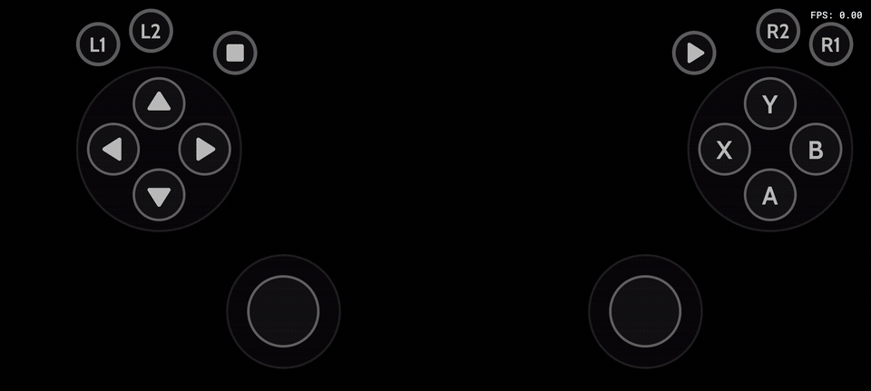

<div align="left">
  <h1>AndroSX2</h1>

  <p>
    
    
    
    
    
    
  </p>

  <p>AndroSX2 is a PS2 emulator for Android. It lets you play a wide range of PS2 games with excellent performance on most modern smartphones. This repository hosts a technical demo showcasing the core features of the project.</p>
</div>

## Preview

<div align="center">
    <h4>In Game</h4>
    
</div>

<div align="center">
    <h4>In BIOS Menu</h4>
    
</div>

## About This Repository

This repository contains a public technical demo of AndroSX2.

The native PS2 emulation core is powered by [AndroSX2Core](https://github.com/hugo94110/AndroSX2Core), a native PCSX2 port for Android.

## Features

- Plays a wide range of PS2 games (not included)
- Excellent performance on most modern smartphones
- BIOS files included, ready to run out of the box
- Extensive customization: patches, cheats, widescreen patches, display and graphics configuration, upscaling, filtering, and more

<!-- <div align="center">
    <h4>App Settings</h4>
    
</div> -->

## Technical Details

- The emulator runs on a port of PCSX2 compiled into a native (C++) library
- Tested on Android 16, arm64-v8a

### Supported Formats

| Format | Extension |
|---|---|
| Compressed disc image | `.chd` |
| ISO image | `.iso` |
| Raw disc image | `.img` |
| Executable | `.elf` |
| Binary image | `.bin` |

## Build

This is a standard Android Studio / Gradle project. You can open it directly in Android Studio and run it from there, or build it from the command line:

```bat
gradlew.bat assembleDebug
```

The APK is produced in `app/build/outputs/apk/`.

## Disclaimer

AndroSX2 is an independent, unofficial project created for educational purposes around Android development and emulation. It is not affiliated with, endorsed by, or connected to Sony Interactive Entertainment or the PCSX2 project.

This software is provided "as is", without warranty of any kind, express or implied. The author assumes no liability for any damage or other consequence resulting from its use.

You are responsible for legally owning any games you use with this software and for complying with the laws of your country regarding emulation and copyright.